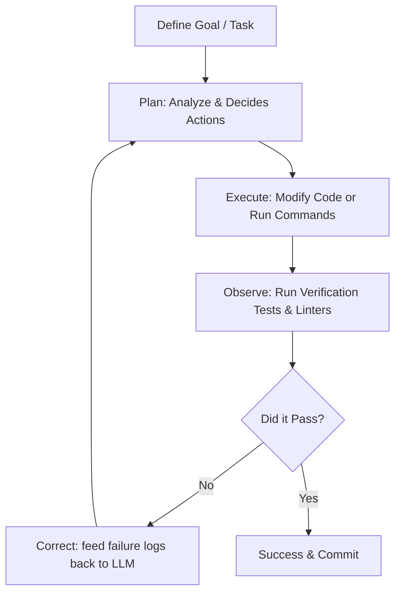

# Introduction to Loop-Driven Development (LDD)

Loop-Driven Development (LDD), also known as Loop Engineering, represents a paradigm shift in how developers build software using Artificial Intelligence. 

Instead of traditional, turn-based prompting—where a human writes a prompt, gets code, spots an error, and manually requests a fix—LDD establishes a closed-loop system where the AI operates autonomously to achieve a high-level goal.

## 1. Core Mechanics of LDD
An LDD environment wraps an LLM in a self-correcting loop that follows a recurring cycle:
1. **Plan**: Analyze the task, check repository files, and decide on a set of edits or commands.
2. **Execute**: Modify the source code or execute diagnostic tools.
3. **Observe**: Run verification checks (e.g., test suites, linters, types verification) and capture stdout/stderr.
4. **Correct**: Feed the test errors, lint violations, or compiler outputs back to the LLM to adjust its course, looping until the tests pass or a budget (max iterations) is hit.

## 2. Shift in Developer Responsibility
In LDD, the developer's role shifts from writing code and micro-prompting the AI to **Harness Engineering**:
* **Defining the Acceptance Criteria**: Writing comprehensive, bulletproof unit and integration tests.
* **Creating the Safety Boundaries**: Setting up the sandbox environment where the agent can run commands without risk of damaging the host machine.
* **Providing Contextual Memory**: Supplying the agent with previous attempts, design guidelines (`CLAUDE.md`), and failure histories (RCA documents).
